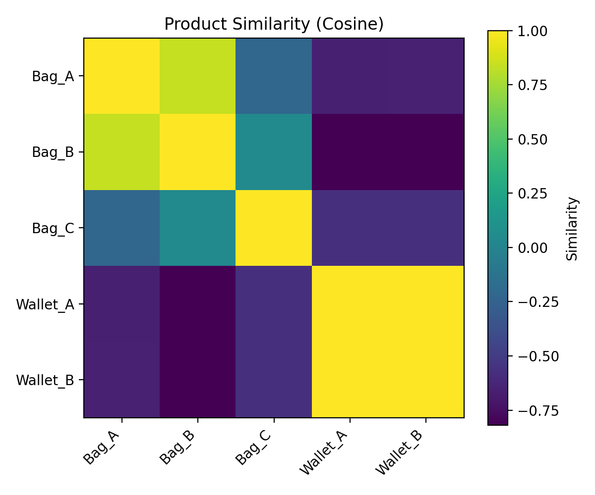

# Product Similarity based on Bill of Materials (Cosine Similarity)


This project replicates a simplified version of an algorithm I previously used in an industrial context to compare product Bills of Materials (BOMs) using cosine similarity.

Each product’s BOM contained the list of materials used to manufacture it, where every material was associated with a specific processing time depending on its type and the manual skill required.  
The algorithm computed a normalized processing-time vector for each product, weighting the contribution of every material in its BOM.  
These vectors were then compared using cosine similarity to identify products with similar material–time structures.

The goal was to detect whether a supplier tended to manufacture different products in a similar way — both technically and operationally — revealing consistency in manual craftsmanship and efficiency.



# Product Similarity based on Bill of Materials (Cosine Similarity)

This project demonstrates how to compute **product-to-product similarity** using **cosine similarity** on a **simulated Bill of Materials (BOM)** and a few numeric features (e.g., price, weight).  
It is intended for portfolio purposes: the dataset is **fully simulated** and does **not** represent any real company data.

## Why this matters
Cosine similarity is useful to compare products by component composition and features, enabling tasks like:
- finding similar items for substitution or assortment planning
- grouping products into families
- building simple recommendation heuristics

## Project structure
```
bom_cosine_similarity/
├─ data/
│  └─ sample_bom.csv          # simulated BOM-like features
├─ cosine_similarity.ipynb    # notebook version
├─ cosine_similarity.py       # script version
├─ requirements.txt
└─ README.md
```

## How to run
```bash
# 1) Create and activate a virtual environment (optional but recommended)
python -m venv .venv
source .venv/bin/activate   # Windows: .venv\Scripts\activate

# 2) Install dependencies
pip install -r requirements.txt

# 3) Run the script or use the notebook
python cosine_similarity.py
# or open cosine_similarity.ipynb in Jupyter/VS Code
```

## Outputs
- `cosine_similarity_matrix.csv` – full similarity matrix
- `cosine_similarity_heatmap.png` – heatmap visualization
- printed top-N similar items via a simple `recommend()` helper

## Notes
- The dataset is intentionally simple to highlight the method.
- You can extend it with additional numeric/categorical features or weighting schemes.
- If you previously used a similar approach in industry, you can mention that this repo **recreates the idea with simulated data** for confidentiality.
